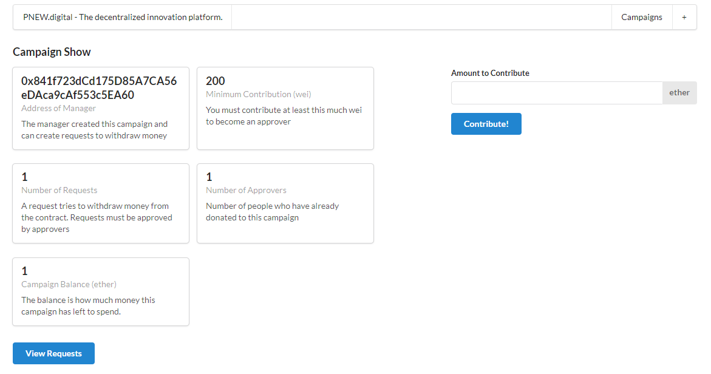

# PNEW.digital - Decentralized Innovation Platform (Next.js UI & Solidity smart contract)

> The PNEW.digital app is a fully-functioning decentralized innovation application that allows users to create campaigns, manage campaigns, fund campaigns, and approve requests on the ethereum blockchain.

## Table of contents

* [General info](#general-info)
* [Screenshots](#screenshots)
* [Technologies](#technologies)
* [Setup](#setup)
* [Features](#features)
* [Status](#status)
* [Inspiration](#inspiration)
* [Contact](#contact)

## General info

The purpose of this project is to help me to better understand Solidity, Ethereum, Next.js and to inspire people with valuable content.

## Screenshots



## Technologies

* Solc - version 0.4.17
* Truffle-hdwallet-provider - version 1.0.17
* Web3 - version 1.4.0
* Next - version 11.0.1
* Next-routes - version 1.4.2
* React - version 17.0.2
* React-dom - version 17.0.2
* Semantic-ui-css - version 2.4.1
* Semantic-ui-react - version 2.0.3

## Setup

Please use yarn install & yarn dev to run the application in your local environment. Please also setup an infura account to deploy your contract.

## Code Examples

Examples of smart contract methods:

```javascript

contract CampaignFactory {
    address[] public deployedCampaigns;

    function createCampaign(uint256 minimum) public {
        address newCampaign = new Campaign(minimum, msg.sender);
        deployedCampaigns.push(newCampaign);
    }

    function getDeployedCampaigns() public view returns (address[]) {
        return deployedCampaigns;
    }
}

contract Campaign {
    struct Request {
        string description;
        uint256 value;
        address recipient;
        bool complete;
        uint256 approvalCount;
        mapping(address => bool) approvals;
    }

    Request[] public requests;
    address public manager;
    uint256 public minimumContribution;
    mapping(address => bool) public approvers;
    uint256 public approversCount;

    modifier restricted() {
        require(msg.sender == manager);
        _;
    }

    function Campaign(uint256 minimum, address creator) public {
        manager = creator;
        minimumContribution = minimum;
    }

    function contribute() public payable {
        require(msg.value > minimumContribution);

        approvers[msg.sender] = true;
        approversCount++;
    }
}

```

## Features

List of features ready and TODOs for future development

* Campaign contract factory
* Campaign overview page
* New campaign page
* Campaign management page (incl. funding & request creation)
* Request management page

To-do list:

* Further improve visual design
* Test cases for frontend
* Deploy frontend to Heroku
* Connect platform to fancy URL

## Status

Project is: _wip_

## Inspiration

Thanks to Udemy for providing inspiring content.

## Contact

Created by [@pwagnerde](https://www.linkedin.com/in/pwagnerde/) - feel free to contact me!
